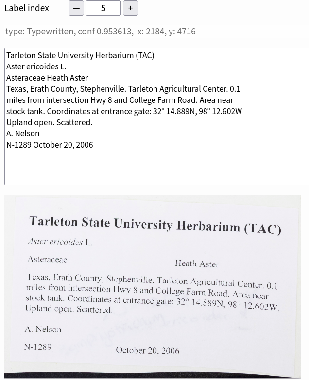

# digi-leap [](https://zenodo.org/badge/latestdoi/334215090)

Extract information from images of herbarium specimen label sheets. This is the automated portion of a full solution that includes humans-in-the-loop.

1. [Brief description](#Brief-description)
2. [Install](#Install)
3. [Pipeline outline](#Pipeline-outline)
4. [References](#References)

Given images like:

[](assets/sheet.jpg)

## Brief description
We want to extract as much text information as possible from the labels. We are mostly targeting labels with typewritten information and not handwritten labels or barcodes, although we may extract some text from barcode labels and some clearly written handwritten text.

## Install
You will need GIT to clone this repository. You will also need to have Python3.11+ installed, as well as pip, a package manager for Python.
You can install the requirements into your python environment like so:
```bash
git clone https://github.com/rafelafrance/digi-leap.git
cd /path/to/traiter
make install
```
There are many moving parts to this project and I have broken this project into several smaller repositories. Some of these smaller repositories may have heavy requirements (like PyTorch) which can take a while to install.

Note that this repository doesn't contain any code itself, it is an umbrella repository for many parts and functions. If you don't want all the functionality of the entire pipeline you may be better off installing only the parts you actually want from their own repositories.

## Pipeline outline

1. [Find all the labels on the images.](#Find-Labels)
2. [OCR the cleaned up label images.](#OCR-Labels)
3. [Use Traiter to extract information from the clean OCR text.](#Rule-based-trait-extraction)
4. [Use a large language model (LLM) to get traits from OCR text.](#Large-language-model-trait-extraction)
5. [Reconcile trait output from the Traiter and the LLM.](#Reconcile-traits)
6. [Other repositories](#Other-repositories)

**Note** that all scripts are available in this repository.

### Find Labels

Repository: https://github.com/rafelafrance/label_finder

We also need to clone the YOLO7 repository separately. https://github.com/rafelafrance/label_finder

This repository contains scripts for training the

[](assets/show_labels.png)

We find labels with a custom trained YOLOv7 model (https://github.com/WongKinYiu/yolov7).

- Labels that the model classified as typewritten are outlined in orange.
- All other identified labels are outlined in teal.
- All label are extracted into their own image file.

Scripts:
- `fix-herbarium-sheet-names`: I had a problem where herbarium sheet file names were given as URLs and it confused the Pillow (PIL) module so I renamed the files to remove problem characters. You may not need this script.
- `yolo-training`: If you are training your own YOLO7 model then you may want to use this script to prepare the images of herbarium sheets for training. The herbarim images may be in all sorts of sizes, and model training requires that they're all uniformly sized.
  - YOLO scripts also requires a CSV file containing the paths to the herbarium sheets and the class and location of the labels on that sheet.
- `yolo-inference`: Prepare herbarium sheet images for inference; i.e. finding labels. The images must be in the same size the training data.
- `yolo-results-to-labels`: This takes for output of the YOLO model and creates label images. The label name contains information about the YOLO results. The label name format:
  - `<sheet name>_<label class>_<left pixel>_<top pixel>_<right pixel>_<bottom pixel>.jpg`
  - For example: `my-herbarium-sheet_typewritten_2261_3580_3397_4611.jpg`
- `filter_labels.py`: Move typewritten label images into a separate directory that are then available for further processing.

You will notice that there are no scripts for running the YOLO models directly. You will need to download that repository separately and run its scripts. Example invocations of YOLO scripts are below:

```bash
python train.py \
--weights yolov7.pt \
--data data/custom.yaml \
--workers 4 \
--batch-size 4 \
--cfg cfg/training/yolov7.yaml \
--name yolov7 \
--hyp data/hyp.scratch.p5.yaml \
--epochs 100 \
--exist-ok
```

```bash
python detect.py \
--weights runs/train/yolov7_e100/weights/best.pt \
--source inference-640/ \
--save-txt \
--save-conf \
--project runs/inference-640/yolov7_e100/ \
--exist-ok \
--nosave \
--name rom2_2022-10-03 \
--conf-thres 0.1
```

### OCR Labels

Repository: https://github.com/rafelafrance/ocr_ensemble

After you have each label in its own image file, you can extract the text from the labels using OCR. We have found that using an ensemble of OCR engines and image processing techniques works better in most cases than just OCR alone.

Image processing techniques:

1. Do nothing to the image. This works best with clean new herbarium sheets.
2. We slightly blur the image, scale it to a size that works with many OCR images, orient the image to get it rightside up, and then deskew the image to finetune its orientation.
3. We perform all the steps in #2 and additionally perform a Sauvola (Sauvola & Pietikainen, 2000) binarization of the image, which often helps improve OCR results.
4. We do all the steps in #3, then remove “snow” (image speckles) and fill in any small “holes” in the binarized image.

[](assets/show_ocr_text.png)

OCR engines:

1. Tesseract OCR (Smith 2007).
2. EasyOCR (https://github.com/JaidedAI/EasyOCR).

Therefore, there are 8 possible combinations of image processing and OCR engines. We found, by scoring against a gold standard, that using all 8 combinations does not always yield the best results. Currently, we use 6/8 combinations with binarize/EasyOCR and denoise/EasyOCR deemed unhelpful.

[](assets/ocr_flow.jpg)

After the image processing & OCR combinations we then:

1. Perform minor edits to fix some common OCR errors like the addition of spaces before punctuation or common character substitutions.
2. Next we find the Levenshtein distance for all pairs of text sequences and remove any sequence that has a Levenshtein score greater than a predetermined cutoff (128) from the best Levenshtein score.
3. The next step in the workflow is to use a Multiple Sequence Alignment (MSA) algorithm that is directly analogous to the ones used for biological sequences but instead of using a PAM or BLOSUM substitution matrix we use a visual similarity matrix. Exact visual similarity depends on the font so an exact distance is not feasible. Instead we use a rough similarity score that ranges from +2, for characters that are identical, to -2, where the characters are wildly different like a period and a W. We also used a gap penalty of -3 and a gap extension penalty of -0.5.
4. Finally, we edit the MSA consensus sequence with a spell checker, add or remove spaces within words, and fix common character substitutions.

Scripts:
- `ocr-labels`: You feed this label images and it returns the OCRed text.
- `char-sub-matrix`: You probably won't need this, but it is a utility script for build the substitution matrix for the multiple sequence alignment. The matrix is analogous to a PAM or BLOSUM matrix.

### Rule based trait extraction

Repository: https://github.com/rafelafrance/FloraTraiter

We are currently using a hierarchy of spaCy (https://spacy.io/) rule-based parsers to extract information from the labels. One level of parsers finds anchor words, another level of parsers finds common phrases around the anchor words, etc. until we have a final set of Darwin Core terms from that label.


I should be able to extract: (Colors correspond to the text above.)


#### Parsing strategy

1. Have experts identify relevant terms and target traits.
2. We use expert identified terms to label terms using spaCy's phrase matchers. These are sometimes traits themselves but are more often used as anchors for more complex patterns of traits.
3. We then build up more complex terms from simpler terms using spaCy's rule-based matchers repeatedly until there is a recognizable trait. See the image below.
4. We may then link traits to each other (entity relationships) using spaCy's dependency matchers.
   1. Typically, a trait gets linked to a higher level entity like SPECIES <--- FLOWER <--- {COLOR, SIZE, etc.} and not peer to peer like PERSON <---> ORG.

For example, given the text: `Petiole 1-2 cm.`:
- I recognize vocabulary terms like:
    - `Petiole` is plant part
    - `1` a number
    - `-` a dash
    - `2` a number
    - `cm` is a unit notation
- Then I group tokens. For instance:
    - `1-2 cm` is a range with units which becomes a size trait.
- Finally, I associate the size with the plant part `Petiole` by using another pattern matching parser. Spacy will build a labeled sentence dependency tree. We look for patterns in the tree to link traits with plant parts.

There are, of course, complications and subtleties not outlined above, but you should get the gist of what is going on here.

Scripts:
- `parse-labels`: This takes the OCR text files and returns traits associated with the labels.
- `parse-treatments`: Not relevant here, but this does the same with treatment extracted from PDFs or scraped from the web.
- `util-add-taxon-terms`: On the off chance that you want to update the catalog of plant terms, you would use this utility.

### Large language model trait extraction

Repository: https://github.com/rafelafrance/traiter_llm.git

Writing a rule-based parser is error-prone and labor-intensive. If we can, we try to use a model to parse the labels. This repository sends label text to GPT4 for parsing.

Scripts:
- `get-gpt-output`: This takes the OCR text files and returns traits associated with the text files, only this time it's from a large language model (LLM), ChatGPT.
- `clean-gpt-output`: Clean the text returned from the LLM. This script only does so much, ChatGPT can get really creative in how it messes up JSON output. **Expect that you will also need to manually update ChatGPT output.**

### Reconcile traits

Repository: https://github.com/rafelafrance/reconcile_traits.git

Both the rule-based parser and ChatGPT have their strengths and weaknesses. The scripts here try to combine their outputs to improve the overall results.

Scripts:
- `reconcile-traits`: This takes the JSON output from both the rule-based parser and ChatGPT and does its best to improve the results.


### Other repositories

#### https://github.com/rafelafrance/digi_leap_old.git

The old digi_leap repository was taking too long to clone, but I wanted to keep its history, so I created this fresh repository for the project.

#### https://github.com/rafelafrance/traiter.git

This repository is used by the rule-based parser (FloraTraiter). It contains all of the rules and code used by every rule-based parser. For plants, insects, mammals, etc.

#### https://github.com/rafelafrance/common_utils.git

This holds utilities used by a lot of repositories. I got tired of changing the same code in several places.

## References

See the following publication in _Applications in Plant Sciences_:

_Humans in the Loop: Community science and machine learning
synergies for overcoming herbarium digitization bottlenecks_

Robert Guralnick, Raphael LaFrance, Michael Denslow, Samantha Blickhan, Mark
Bouslog, Sean Miller, Jenn Yost, Jason Best, Deborah L Paul, Elizabeth Ellwood,
Edward Gilbert, Julie Allen
